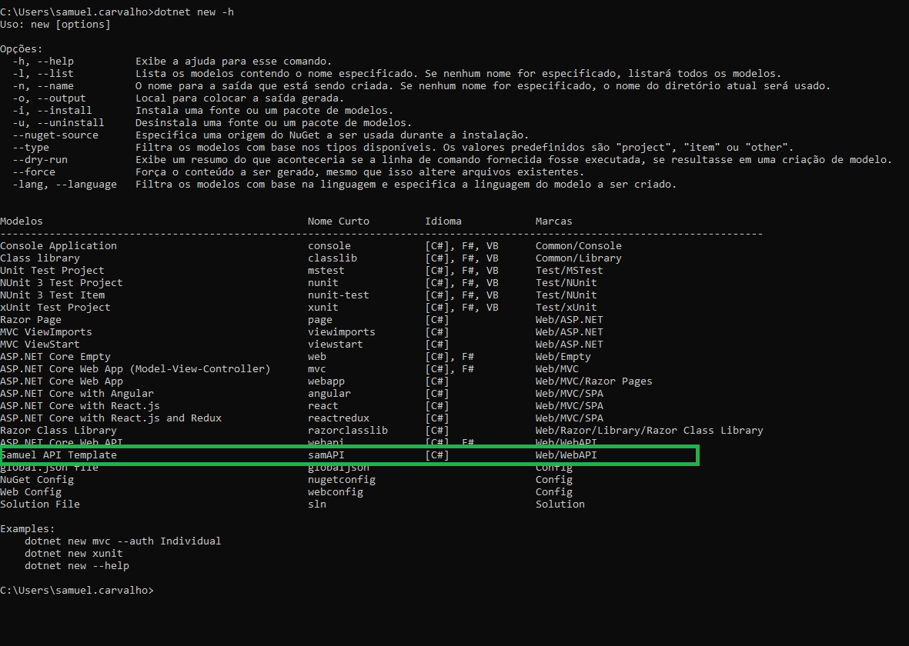

# Template Web API ASP.NET Core

Exemplo de um template asp.net core, estruturado com DDD. Serve como uma casca com exemplos para agilizar o inicio de um projeto novo.

Este template já vem configurado com:
-  swagger;
-  logs;
-  exemplos de testes(testes unitários, e testes de integração);
-  configurações de docker;
-  compressão do retorno da api( compressão do Json no formato .Gzip);

# Instalação

Para fazer a instalação do template na sua máquina basta usar o comando na raiz do projeto : 

```
dotnet new -i .
```

# Uso

Após a instalação será possível visualizar o template na linha de comando ao usar o comando:

```
dotnet new -h
```     

Será listado o template conforme abaixo:





Para utiliza-lo use o comando:

```
dotnet new samApi -n <nome api>
```

# Requisitos

Para instalar o template é preciso ter instalado o SDK do .NET Core 2.0 ou alguma versão acima.

# Referências

https://docs.microsoft.com/pt-br/dotnet/core/tools/custom-templates

https://docs.microsoft.com/pt-br/dotnet/core/tools/dotnet-new?tabs=netcore21

https://github.com/dotnet/templating/wiki/Reference-for-template.json


